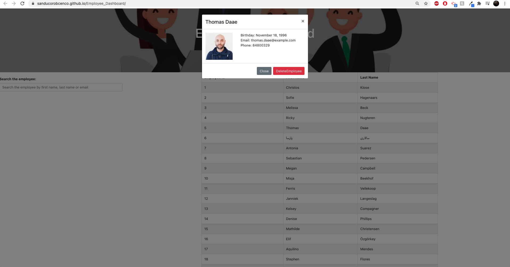

# Employee_Dashboard

* [About-project](#Description)
* [Usage](#Usage)
* [License](#License)
* [Contributor](#Contributor)
* [Email-address](#Email)
* [LinkedIn-profile](#LinkedIn-profile)
* [GitHub-profile](#GitHub-profile)

   
### About the project:
This REACT application is a simply front-end app that allows the user(manager) view information about employees. The random user is being generated by Random API. The user can search employee by first name, last name or email, then user can view info and delete the employee. 

Screenshot: 

### Usage:
Open deployment application [https://sanducorobcenco.github.io/Employee_Dashboard/]

### License:
MIT

### Contributor:
Sandu Corobcenco

### Email address:
corobcenco.sandu@gmail.com

### LinkedIn profile:
https://www.linkedin.com/in/sandu-corobcenco-527131165/

### GitHub profile:
https://github.com/SanduCorobcenco
